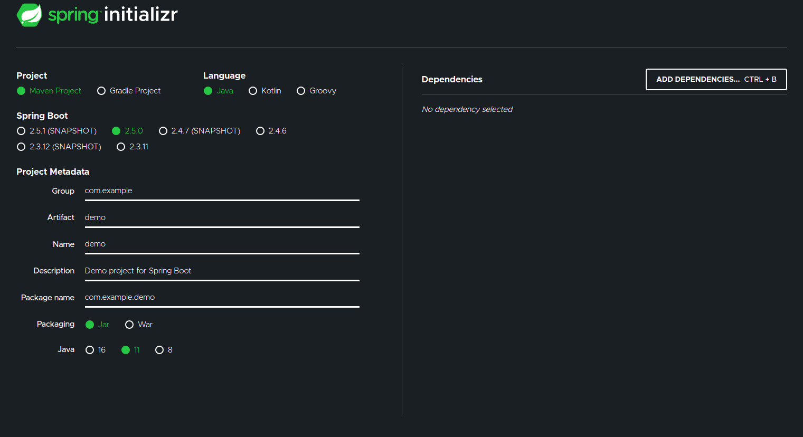

## Criando uma API Rest de consulta de cidades do Brasil.

Este foi um projeto desenvolvido pela <a href="https://www.linkedin.com/school/digitalinnovation-one/">Digital Innovation One</a> e <a href="https://www.linkedin.com/in/andreluisgomes/">André Gomes</a> em parceria com a <a href="https://www.linkedin.com/company/everis/">Everis</a>. A ideia deste projeto foi desenvolver uma API Rest para consultar as cidades do Brasil através do id, ddd, estado, cidade. Além de criar, também foi possível aprender como testar a API através do Postman (Extensão do Google Chrome) e <a href="https://id.heroku.com/">Heroku(Serviço de nuvem).</a>

Primeiramente para foi criado o Gradle Project no  <a href="https://start.spring.io/">Spring Boot - Spring Initializr</a>. Nele é possível escolher o tipo do projeto - neste caso Gradle Project - a versão do Spring boot,nome do domínio, do projeto, uma breve descrição, o topo do packing, versão do java (linguagem escolhida) e por último e não menos importante, as dependências - no nosso caso foram escolhidas as Spring Web, Spring Data JPA e PostgreSQL driver.

Após realizar o download do arquivo, só extrair numa pasta da sua escolha, normalmente ponho os projetos numa chamada workspace, a maioria faz isso na verdade. Uma vez tendo o file extraído no local da sua preferência, abri-lo com o IntelliJ IDEA, que foi a IDE utilizada neste projeto. Ao abrir este projeto as dependências serão instaladas automanticamente ao iniciar. As configurações escolhidas podem ser conferidas no 'build.gradle'. Deve-se checar antes de se desenvolver o projeto se as versões do jdk e gradle são compatíveis, isso é realmente um time consuming mas faz a diferença - falo por experiência própria - neste projeto foi-se utilizada a versão jdk 11.

Para manejar o bando de dados foi-se utilizado o <a href="https://www.docker.com/">docker</a>, com ele é possível empacotar containers e usa-lo em produção, com ele foi usado uma imagem postgres para rodar o container gerado pelo docker para a aplicação em criação. Portanto, foi-se criado o container com configurações do banco de dados através do postres através do comando:

`docker run --name dio-cities-db -d -p 5432:5432 -e POSTGRES_USER=postgres_user_city -e POSTGRES_PASSWORD=super_password -e POSTGRES_DB=cities postgres`

Partindo para o IntelliJ foi possível dar um run no CitiesApplication e iniciar o Spring Web. Já no arquivo application.properties as configurações relacionadas a conexão com o banco dados foram inseridas (url, username e password, respectivamente). Feito este procedimento, RUN! localhost:8080. O server estava funcionando muito embora não tivessemos nada pronto ainda.

Praticamente o projeto foi desenvolvido por IntelliJ e terminal do ubuntu, o que pode ser considerado tiring e challenge para alguns, no fim das contas consegui absorver alguns comandos que salvam tempo. Começa agora as configurações do banco de dados na aplicação, expor os bancos de dados com recurso REST. Clonou-se o banco de dados das cidade do autor<a href="https://github.com/chinnonsantos/sql-paises-estados-cidades"> Chinnon Santos</a>, que foi utilizado como db.

Mais vez o comando foi realizado para criar outro container mapeando a pasta postgres dentro do projeto, utilizando bash (interpretador de share scripts).

`docker run --name cities-db -d -p 5432:5432 -e POSTGRES_USER=postgres_user_city -e POSTGRES_PASSWORD=super_password`

`docker run -it --rm --net=host -v $PWD:/tmp postgres /bin/bash`

Uma vez mapeados, é hora de rodar os arquivos dentro do container:

`psql - h localhost -U postgres_user_city cities -f /tmp/pais.sql` 

Ao realizar o comando será solicitado o password, inserir e será possível visualizar um esboço de como será formatado o arquivo no postgres. Uma vez rodando,  o próximo passo foi criar as entidades - classes, construtores, metodos, interface e anotações através do IntelliJ. Nesse momento foi possível visualizar na prática o uso da javax.persistence - como visto também no bootcamp Cody Anywhere da Avanade.

Após configurado, o projeto foi testado com o uso do postman. Vale a pena ressaltar que a organização das informações consultadas pelo postman/browser ficaram com uma formatação ideal foi por conta da extensão do google chamada JSON Formatter. Nos finalmentes, o servidor foi rodado pela nuvem através do heroku. Por ele é possível criar aplicação, autenticar, escalar, entre outras ações, desde de que se realize um 'push' do repositório local para o heroku, assim como feito para o github, aliás, feito para o github primariamente. Ao criar o banco de dados no heroku possibilita-se consultar o servidor diretamente por esta aplicação.

Essa experiência proporcionada pela DIO foi rica no que concerne ao uso de ferramentas utilizadas para o desenvolvimento de APIs. Para além da linguagem Java, emitiu-se a concepção de big picture do processo de elaboração de uma API Rest até os aspectos mais especifícos. O mais incrível é que após todo esse processo ainda é cabivel mais implementações.
